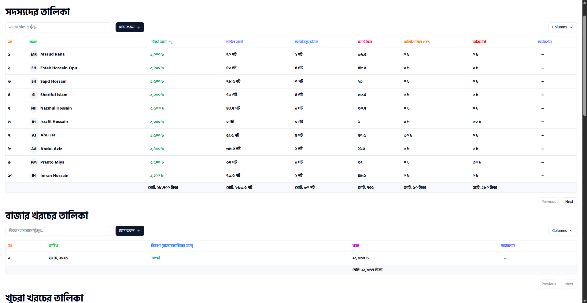

# 🧾 Easy Mess Manager

> A modern web application for managing mess members, meals, market expenses, miscellaneous costs, and monthly accounts in one place.

[](https://easy-mess-calculation.vercel.app/)
[](https://github.com/NazmulHossain2905/easy-mess-calculation)

---

## ✨ Overview

**Easy Mess Manager** is a React-based mess management and calculation application designed to make monthly mess accounting easier and more organized.

It provides dedicated sections for managing members, market expenses, small expenses, miscellaneous costs, additional information, and account charts. The application supports both a **single-page layout** and a **tab-based layout**.

Built with **React, TypeScript, Vite, Tailwind CSS, Redux Toolkit, and Redux Persist**, it also includes utilities for calculations, tables, notifications, and PDF/report generation.

---

## 📸 Preview

<p align="center">
  
</p>

---

## 🚀 Live Project

**Live Demo:**  
https://easy-mess-calculation.vercel.app/

---

## 🛠️ Tech Stack

### Core

- ⚛️ React 19
- 🔷 TypeScript
- ⚡ Vite
- 🎨 Tailwind CSS 4

### State Management

- Redux Toolkit
- React Redux
- Redux Persist

### UI & Components

- Radix UI
- Headless UI
- Lucide React
- Class Variance Authority
- Tailwind Merge
- Sonner

### Data & Utilities

- TanStack React Table
- Math.js
- Date-fns
- Rand UID

### Export & Reporting

- React PDF Renderer
- jsPDF
- jsPDF AutoTable
- HTML2Canvas Pro
- HTML2PDF.js

---

## ✨ Features

- 👥 **Member Management** — manage mess members and member-related calculations.
- 🛒 **Market Expense Management** — record and manage market/meal expenses.
- 🧾 **Small Expense Management** — track smaller day-to-day costs.
- 📦 **Miscellaneous Expenses** — manage additional costs.
- 🍚 **Meal Calculations** — calculate fixed meals, meal rates, and per-member meal costs.
- 💰 **Cost Calculations** — calculate per-member miscellaneous and total costs.
- 📊 **Account Chart** — view summarized monthly account information.
- 📄 **PDF Export** — generate PDF reports and tables.
- 🗂️ **Multiple Layouts** — switch between single-page and tab-based layouts.
- 💾 **Persistent State** — preserve application data with Redux Persist.
- 🗑️ **Bulk Delete** — clear all records or individual categories.
- 🔔 **Toast Notifications** — user feedback through Sonner.
- 📱 **Responsive UI** — responsive interface powered by Tailwind CSS.

---

## 📦 Dependencies

### Production Dependencies

```text
@headlessui/react
@radix-ui/react-avatar
@radix-ui/react-checkbox
@radix-ui/react-dialog
@radix-ui/react-dropdown-menu
@radix-ui/react-label
@radix-ui/react-navigation-menu
@radix-ui/react-popover
@radix-ui/react-separator
@radix-ui/react-slot
@radix-ui/react-tabs
@react-pdf/renderer
@reduxjs/toolkit
@tailwindcss/vite
@tanstack/react-table
class-variance-authority
clsx
date-fns
html2canvas-pro
html2pdf.js
jspdf
jspdf-autotable
lucide-react
mathjs
rand-uid
react
react-day-picker
react-dom
react-redux
redux-persist
sonner
tailwind-merge
tailwindcss
```

### Development Dependencies

```text
@eslint/js
@types/node
@types/react
@types/react-dom
@vitejs/plugin-react-swc
eslint
eslint-plugin-react-hooks
eslint-plugin-react-refresh
globals
prettier
prettier-plugin-tailwindcss
tw-animate-css
typescript
typescript-eslint
vite
```

---

## 📋 Prerequisites

Before running the project locally, make sure you have:

- **Node.js**
- **npm**
- **Git**

Verify your environment:

```bash
node --version
npm --version
git --version
```

---

## ⚙️ Installation

### 1. Clone the repository

```bash
git clone https://github.com/NazmulHossain2905/easy-mess-calculation.git
```

### 2. Navigate to the project

```bash
cd easy-mess-calculation
```

### 3. Install dependencies

```bash
npm install
```

### 4. Start the development server

```bash
npm run dev
```

Vite will display the local development URL in your terminal, typically:

```text
http://localhost:5173
```

---

## 🏗️ Production Build

Build the application:

```bash
npm run build
```

Preview the production build:

```bash
npm run preview
```

---

## 🧹 Linting

Run ESLint:

```bash
npm run lint
```

---

## 🔐 Environment Variables

No environment variables are currently required for the application based on the repository configuration.

If environment variables are introduced later, document them here. For example:

```env
VITE_API_URL=
```

> Never commit real secrets or private API keys to GitHub.

---

## 📁 Project Structure

```text
easy-mess-calculation/
├── public/
│   └── logo.png
│
├── src/
│   ├── components/
│   │   ├── models/
│   │   ├── ui/
│   │   ├── AccountChart.tsx
│   │   ├── DownloadPdf.tsx
│   │   ├── MarketerList.tsx
│   │   ├── OtherCostList.tsx
│   │   ├── OthersFileds.tsx
│   │   ├── PdfExportExample.tsx
│   │   ├── SmallCostList.tsx
│   │   └── UserList.tsx
│   │
│   ├── interfaces/
│   ├── lib/
│   ├── store/
│   │   └── slices/
│   ├── utils/
│   ├── App.tsx
│   ├── index.css
│   └── main.tsx
│
├── chart.html
├── components.json
├── eslint.config.js
├── index.html
├── package.json
├── tsconfig.json
├── tsconfig.app.json
├── tsconfig.node.json
└── vite.config.ts
```

---

## 🧮 Calculation & Reporting

The application includes calculations for common mess-accounting values such as:

```text
Meal Rate
= Total Market Cost ÷ Total Fixed Meals

Per-Member Miscellaneous Cost
= Total Miscellaneous Cost ÷ Number of Members

Fixed Meal Cost
= Meal Rate × Member's Fixed Meals

Total Fixed Meal Cost
= Fixed Meal Cost + Per-Member Miscellaneous Cost
```

The project also includes a dedicated monthly account chart/report containing member-level accounting information.

---

## 🔗 Useful Links

- 🌐 **Live Project:** https://easy-mess-calculation.vercel.app/
- 💻 **GitHub Repository:** https://github.com/NazmulHossain2905/easy-mess-calculation
- 📦 **Package Configuration:** https://github.com/NazmulHossain2905/easy-mess-calculation/blob/main/package.json
- 📊 **Account Chart Template:** https://github.com/NazmulHossain2905/easy-mess-calculation/blob/main/chart.html

---

## 👨‍💻 Author

**Nazmul Hossain**

- GitHub: https://github.com/NazmulHossain2905

---

## 📄 License

No explicit license file is currently included in the repository.

---

<p align="center">
  Made with ❤️ using React & TypeScript
</p>
